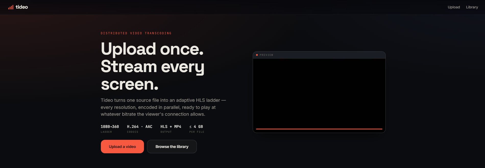
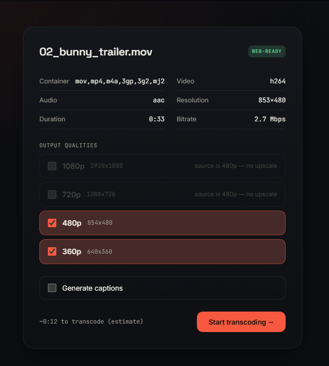

# Tideo

**Upload one video, get back an adaptive-quality stream.** Tideo turns a single source file into a
full HLS ladder — every resolution encoded in parallel, with poster, scrubbable storyboard, an embed
player, and optional captions. It's the thing YouTube does in the first minutes after an upload, built
as a real distributed pipeline you can run, break, and watch scale.

**[▶ Live](https://tideo.vercel.app/)** &nbsp;·&nbsp;
[API & docs](https://bukunmi2108-tideo.hf.space/docs) &nbsp;·&nbsp;
[Source](https://github.com/Bukunmi2108/tideo)

> The live backend runs on an ephemeral Hugging Face Space — outputs reset on restart (~1-day TTL).
> Upload and watch within a session; shared output links are temporary by design.

<p align="center">
  
</p>

## How it works

```
upload ──▶ inspect ──▶ [ you pick ] ──▶ transcode ──▶ package ──▶ done
 stream     ffprobe      renditions       parallel       HLS
 sha256     + recommend  + captions       FFmpeg         master.m3u8
 dedupe     a ladder                      + poster/sprite + web.mp4
                                   └──▶ transcribe (faster-whisper → VTT, fail-soft) ──┘
```

You upload a file; the API streams it to disk while hashing it (identical bytes never transcode twice).
`ffprobe` reads the source and recommends a ladder capped at the source height — no upscaling. You pick
the renditions (and whether to caption), then every rendition encodes **in parallel** on CPU workers,
fans back into a single HLS package, and the job goes `done`.

<p align="center">
  
  <br />
  <em>The commit step: Tideo probes the source, greys out rungs it won't upscale, and lets you choose.</em>
</p>

## Architecture

Two brokers, on purpose — the project is a deliberate study of distributed-systems patterns.

```
            ┌─────────────── Kafka (KRaft) ───────────────┐   facts: append-only, replay-safe
 FastAPI ──▶│  topic media-jobs  (partitioned by job_id)  │──▶ dispatcher ──▶ RabbitMQ ──▶ Celery
   API      └──────────────────────────────────────────────┘   (only bridge)   commands    workers
    │                                                                │                      heavy+fast
    ├─ Redis ── hot state · live progress (pub/sub) · dedupe + refcount counters            │
    └─ Postgres ── cold/terminal state · event audit log  ◀──────────── audit consumer ─────┘
```

- **RabbitMQ carries commands** — "do this work, once, soon." Acked, then deleted. Competing consumers.
- **Kafka carries facts** — "this happened, remember it." Append-only, per-`job_id` ordering, replayed
  safely by independent consumer groups.
- The **dispatcher is the only Kafka→Celery bridge**. It reads `job.created`, guards duplicates with an
  idempotent `SET NX`, and enqueues the work. So *stop RabbitMQ and the API still accepts jobs*, and
  replaying the audit log never re-runs a transcode.
- **Redis** holds hot state and streams progress over pub/sub to the browser via WebSocket; **Postgres**
  is the cold store for terminal jobs, per-rendition outcomes, and the event audit log.

## Stack

| Area | What | Tech |
|---|---|---|
| `app/` | FastAPI API, Celery tasks per queue, Kafka producer/consumers, dispatcher, storage layer | FastAPI · Celery · Python 3.12 · FFmpeg |
| `frontend/` | SPA — upload, inspect/commit, library, Netflix-style immersive watch page | Vite · vanilla TypeScript · `hls.js` (only runtime dep) |
| `deploy/` | the whole stack in one image (Postgres · Redis · RabbitMQ · Kafka · API · workers) under supervisord → [HF Space](https://huggingface.co/spaces/Bukunmi2108/tideo) | Docker · supervisord |

## Repo layout

| dir | what |
|---|---|
| `app/` | backend — `api/` routes, `workers/` (inspect/rendition/package/transcribe/cleanup), `dispatcher/`, `domain/` (ladder, errors, state, playlist), `events/` (Kafka), `storage/` (Redis, Postgres, dedupe, pressure) |
| `frontend/` | Vite vanilla-TS SPA — `router.ts`, `landing.ts`, `upload.ts`, `history.ts`, `job.ts`, `player.ts`, `sprite.ts` |
| `deploy/` | single-container HF Space — `Dockerfile`, `supervisord.conf`, per-service start scripts |
| `docs/` | `PLAN.md`, phase writeups, ADRs, chaos drills |
| `fixtures/` · `scripts/` | generated test videos + their build/verify scripts |
| `tests/` | ~43 pytest files incl. a classified FFmpeg-stderr corpus and chaos drills |

## Run it locally

```bash
# 1. the full stack: Postgres, Redis, RabbitMQ, Kafka, API, workers, dispatcher, beat
make up                                   # docker compose up -d   (API on :8000)

# 2. the frontend
cd frontend && npm install && npm run dev # :5173, points at the local API

# 3. (optional) generate test videos
make fixtures
```

Tests: `uv run pytest` (backend) · `npm test` in `frontend/` (vitest). The single-container image that
runs on Hugging Face lives under `deploy/`.

## Attribution

Built on [FFmpeg](https://ffmpeg.org/), [faster-whisper](https://github.com/SYSTRAN/faster-whisper),
and [hls.js](https://github.com/video-dev/hls.js). Backend on a Hugging Face Docker Space, frontend on
Vercel.
