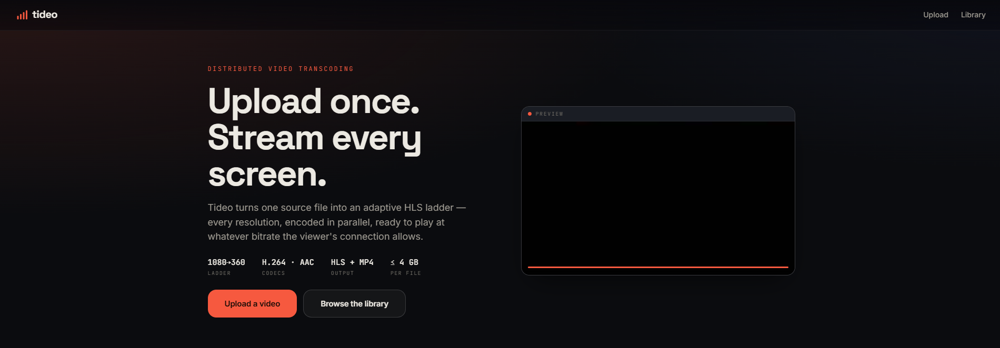
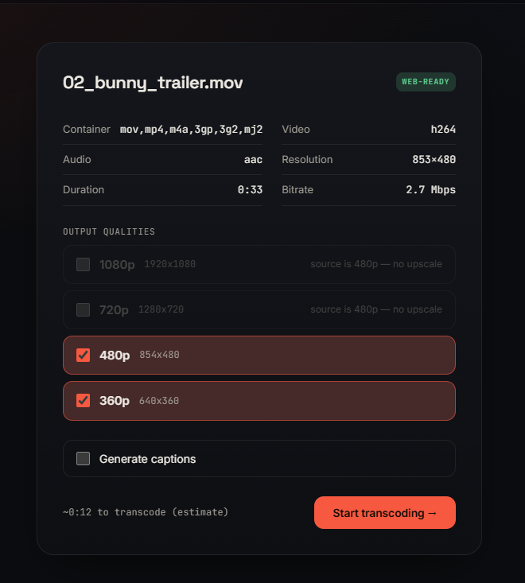

# Tideo

**Upload one video, get back an adaptive-quality stream.** Tideo turns a single source file into a
full HLS ladder - every resolution encoded in parallel, with poster, scrubbable storyboard, an embed
player, and optional captions. It's the thing YouTube does in the first minutes after an upload, built
as a real distributed pipeline you can run, break, and watch scale.

**[▶ Live](https://tideo.vercel.app/)** &nbsp;·&nbsp;
[API & docs](https://tideo-api.duckdns.org/docs) &nbsp;·&nbsp;
[Source](https://github.com/Bukunmi2108/tideo)

> The live backend runs on the Workspace VPS. Outputs are temporary and expire after the configured
> retention window.

<p align="center">
  
</p>

## How it works

```
upload ──▶ inspect ──▶ [ you pick ] ──▶ transcode ──▶ package ──▶ done
 stream     ffprobe      renditions       parallel       HLS
 sha256     + recommend  + captions       FFmpeg         master.m3u8
 dedupe     a ladder                      + poster/sprite + web.mp4
                                   └──▶ transcribe (faster-whisper → VTT, fail-soft) ──┘
```

You upload a file; the API streams it to disk while hashing it (identical bytes within one guest
session never transcode twice).
`ffprobe` reads the source and recommends a ladder capped at the source height — no upscaling. You pick
the renditions (and whether to caption), then every rendition encodes **in parallel** on CPU workers,
fans back into a single HLS package, and the job goes `done`.

<p align="center">
  
  <br />
  <em>Tideo probes the source, greys out rungs it won't upscale, and lets you choose.</em>
</p>

## Architecture

Two brokers, on purpose — the project is a deliberate study of distributed-systems patterns.

```
            ┌─────────────── Kafka (KRaft) ───────────────┐   facts: append-only, replay-safe
 FastAPI ──▶│  topic media-jobs  (partitioned by job_id)  │──▶ dispatcher ──▶ RabbitMQ ──▶ Celery
   API      └──────────────────────────────────────────────┘   (only bridge)   commands    workers
    │                                                                │                      heavy+fast
    ├─ Redis ── hot state · live progress (pub/sub) · dedupe + refcount counters            │
    └─ Postgres ── cold/terminal state · event audit log  ◀──────────── audit consumer ─────┘
```

- **RabbitMQ carries commands** — "do this work, once, soon." Acked, then deleted. Competing consumers.
- **Kafka carries facts** — "this happened, remember it." Append-only, per-`job_id` ordering, replayed
  safely by independent consumer groups.
- The **dispatcher is the only Kafka→Celery bridge**. It reads `job.created`, guards duplicates with an
  idempotent `SET NX`, and enqueues the work. So *stop RabbitMQ and the API still accepts jobs*, and
  replaying the audit log never re-runs a transcode.
- **Redis** holds hot state and streams progress over pub/sub to the browser via WebSocket; **Postgres**
  is the cold store for terminal jobs, per-rendition outcomes, and the event audit log.

## Guest ownership

Tideo identifies a browser with a versioned, random 256-bit token stored in `localStorage`. Owner
operations send it in `X-Tideo-Session`; the progress WebSocket sends it in its first client frame.
The backend stores only the token's SHA-256 digest and scopes upload dedupe, job reads and controls,
and “My videos” history to that digest. Unknown and foreign jobs return the same 404 response.

This is guest continuity, not an account: clearing site data loses access to the browser's history.
Completed media remains shareable through its opaque `job_id` capability URLs, which deliberately do
not carry the guest token in a URL, playlist, log, or referrer.

## Stack

| Area | What | Tech |
|---|---|---|
| `app/` | FastAPI API, Celery tasks per queue, Kafka producer/consumers, dispatcher, storage layer | FastAPI · Celery · Python 3.12 · FFmpeg |
| `frontend/` | SPA — upload, inspect/commit, library, Netflix-style immersive watch page | Vite · vanilla TypeScript · `hls.js` (only runtime dep) |
| `deploy/` | Workspace VPS Compose topology and exact-revision deploy command | Docker · Compose · Sablier |

## Repo layout

| dir | what |
|---|---|
| `app/` | backend — `api/` routes, `workers/` (inspect/rendition/package/transcribe/cleanup), `dispatcher/`, `domain/` (ladder, errors, state, playlist), `events/` (Kafka), `storage/` (Redis, Postgres, dedupe, pressure) |
| `frontend/` | Vite vanilla-TS SPA — `router.ts`, `landing.ts`, `upload.ts`, `history.ts`, `job.ts`, `player.ts`, `sprite.ts` |
| `deploy/` | sleep-aware Workspace VPS deployment |
| `docs/` | `PLAN.md`, phase writeups, ADRs, chaos drills |
| `fixtures/` · `scripts/` | generated test videos + their build/verify scripts |
| `tests/` | ~43 pytest files incl. a classified FFmpeg-stderr corpus and chaos drills |

## Run it locally

```bash
# 1. the full stack: Postgres, Redis, RabbitMQ, Kafka, API, workers, dispatcher, beat
make up                                   # docker compose up -d   (API on :8000)

# 2. the frontend
cd frontend && npm install && npm run dev # :5173, points at the local API

# 3. (optional) generate test videos
make fixtures
```

Tests: `uv run pytest` (backend) · `npm run check` in `frontend/` (tests, typecheck/build, and audit).

The production frontend gate adds Playwright journeys in Chromium, Firefox, and WebKit, with axe
checks after important interactive states:

```bash
cd frontend
npx playwright install --with-deps chromium firefox webkit # first run only
npm run build
npm run check:browser
```

The Vercel project root is `frontend/`; `frontend/vercel.json` owns the SPA fallback and browser
security headers. Its CSP temporarily allows inline styles because progress, storyboard, and player
positioning use element style attributes. Remove that exception when those styles move behind classes
or CSS custom properties during the design-system phase.

## Workspace VPS

`deploy/compose.production.yaml` runs the same distributed pipeline as separate containers, uses the
Workspace PostgreSQL service, and gives every Tideo-owned container the `tideo` Sablier group. Redis,
RabbitMQ, Kafka, uploads, and outputs use persistent volumes. `app.core.sleep` refreshes the session
while jobs, queues, or Kafka consumer lag remain; once they drain, the standard idle timer can stop the
whole group. Runtime values start from `deploy/.env.example`, and `deploy/deploy.sh` deploys one exact
Git SHA without overwriting the VPS `.env` file.

## Attribution

Built on [FFmpeg](https://ffmpeg.org/), [faster-whisper](https://github.com/SYSTRAN/faster-whisper),
and [hls.js](https://github.com/video-dev/hls.js). Backend on the Workspace VPS, frontend on Vercel.
