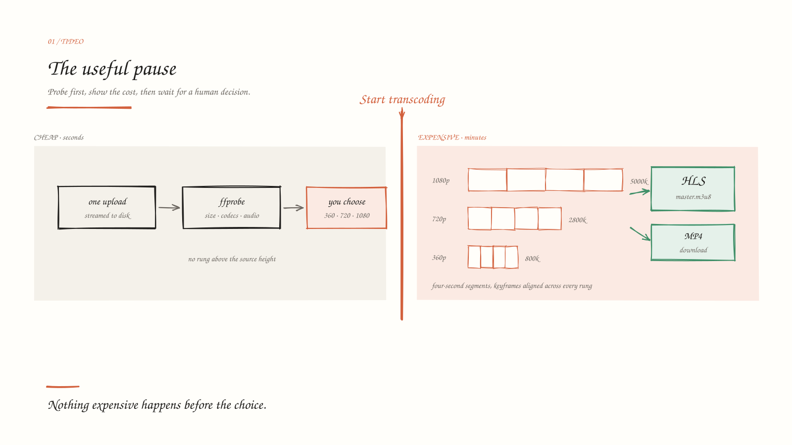
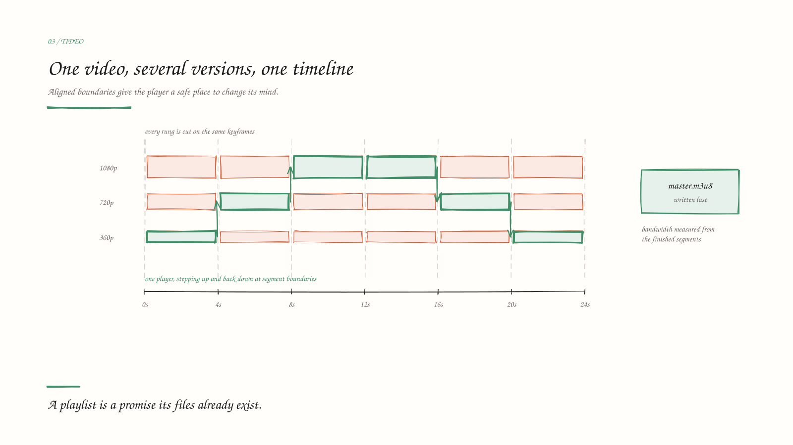
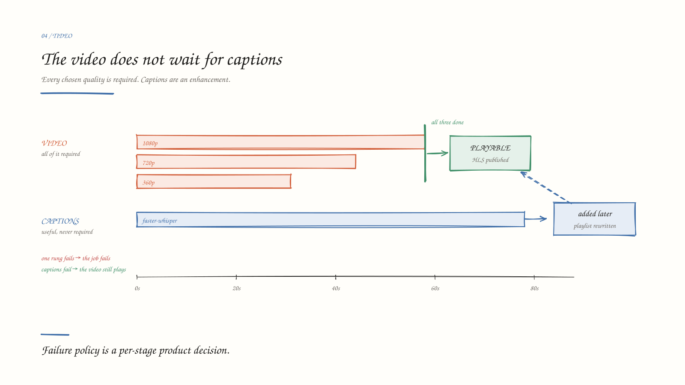
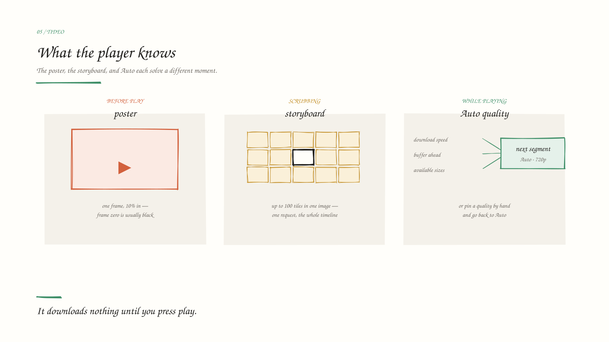
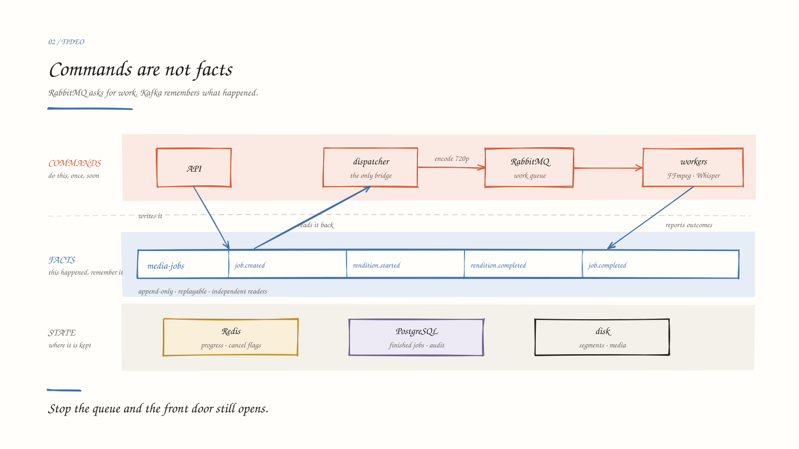
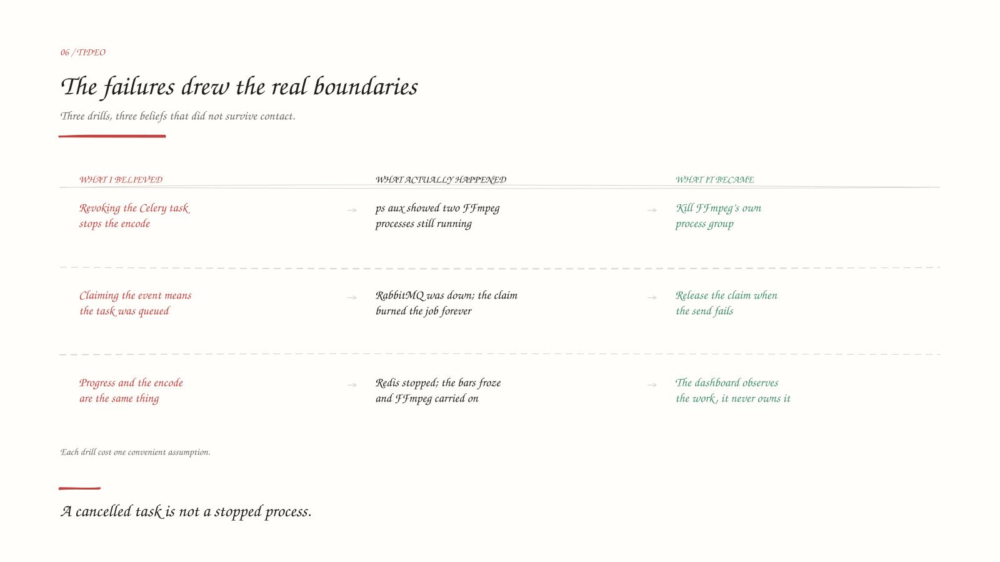
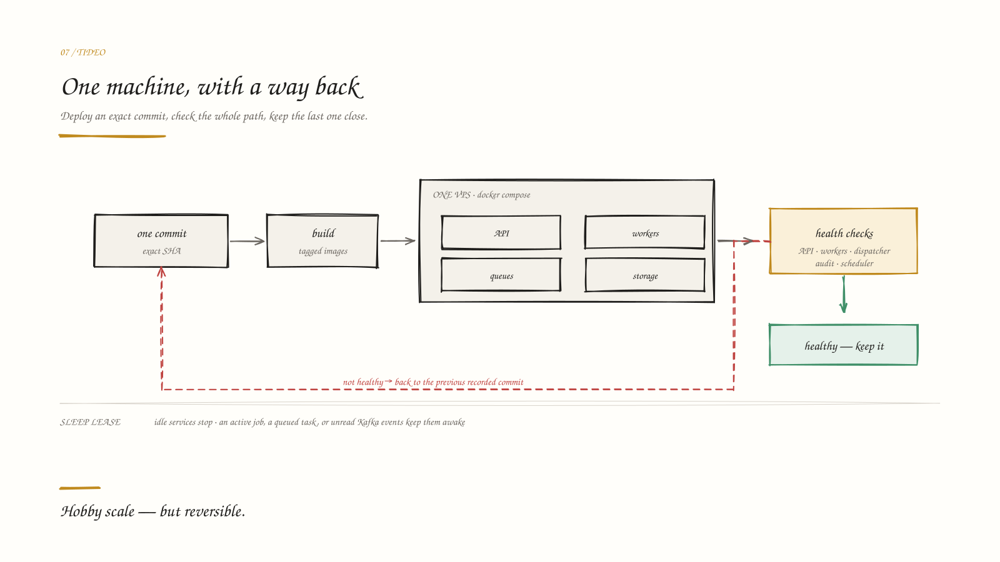

# I built a video pipeline. The most important part was a pause.

## What Tideo taught me about adaptive video, failed assumptions, and honest limits

People talk about FFmpeg as though it were a load-bearing wall of the internet. One
project, one impossible command-line interface, and every video you have ever watched
passing through it somewhere. I wanted to know what that actually meant, so I decided to
use it for something real.

That was the excuse. The actual reason was that I had never built a distributed system in
a personal project. I knew what Kafka, RabbitMQ, Celery and Redis each were, separately,
in the way you know things you have only read about. I had never had to decide which one
carries what.

Video turned out to be a good way to be forced into it. Give FFmpeg a file, ask for a few
resolutions, upload the results somewhere. That sounds simple enough. It stops sounding
simple when you try to build the whole experience around it.

What happens if the file is corrupt? How do you know which resolutions to create? What if
one encode fails? How does the player switch quality without jumping or freezing? What
happens when someone closes the page, cancels a job, or uploads the same file twice?

I built **Tideo** to answer those questions for myself.

Tideo is a personal learning project. It does not have accounts, billing, DRM, or global
storage. What it does have is one complete path I can understand from end to end:

> Upload one video, inspect it, choose the output qualities, process it, and play it as an
> adaptive stream.

Along the way, Tideo also creates a downloadable MP4, a poster image, timeline previews,
and optional captions.

**Try it:** [tideo.vercel.app](https://tideo.vercel.app/)  
**API docs:** [tideo-api.duckdns.org/docs](https://tideo-api.duckdns.org/docs)  
**Date:** 4 August 2026



## The short version

Here is what happens when someone uses Tideo:

1. They upload a video.
2. Tideo checks what is inside the file.
3. It recommends sensible output sizes without enlarging the source.
4. The user chooses what they want and starts the expensive work.
5. FFmpeg creates the selected versions in parallel.
6. Tideo packages them as HLS, the format that lets a player change quality while the
   video is running.
7. The player watches the network and chooses a suitable version.

The frontend is plain TypeScript and Vite. The backend uses FastAPI, Celery, FFmpeg,
RabbitMQ, Kafka, Redis, and PostgreSQL.

That is more infrastructure than a video app of this size needs, and that was the point.
Learning where each piece is actually useful was the reason the project existed; the video
pipeline was the excuse to find out.

## Why I did not start the encode immediately

The most important part of Tideo may be the moment when it does nothing.

After an upload, Tideo stops and shows what it found. It might say:

- 1920 × 1080;
- four minutes and twelve seconds;
- H.264 video with AAC audio;
- recommended outputs: 360p, 480p, 720p, and 1080p.

The user can change that selection before pressing **Start transcoding**.

I added this pause because uploading and checking a file are cheap compared with encoding
it several times. I did not want a harmless upload request to quietly start minutes of CPU
work.

The backend follows the same rule as the screen. A job moves through these states:

`inspecting → awaiting choice → queued → transcoding → done`

The button is therefore not only a visual confirmation. It marks a real cost boundary in
the system.

This was a useful product lesson for me: if an action is expensive, slow, or difficult to
undo, show the user what will happen before starting it.

## First, learn what is inside the file

A filename such as `holiday.mp4` tells me almost nothing about the media inside it. MP4 is
a container. The video inside might use H.264, and the audio might use AAC, but that is
not guaranteed.

Tideo uses `ffprobe`, a tool that comes with FFmpeg, to inspect the upload. It reads:

- width and height;
- rotation;
- duration;
- frame rate;
- video and audio codecs;
- bitrate;
- whether the file has audio.

The command is small. Most of the work is turning its JSON into rules the rest of Tideo
can trust:

```bash
ffprobe -v error -print_format json -show_format -show_streams input.mp4
```

Rotation deserves special treatment. A phone video may store landscape-shaped pixels with
an instruction saying “rotate this when you display it.” If I ignored that instruction,
Tideo could recommend the wrong output sizes for portrait video.

Inspection is also where bad input becomes a clear product error. Tideo rejects files with
no video, corrupt media, extreme dimensions, excessive bitrate, or a duration beyond the
configured limit.

The recommendation is intentionally simple. Tideo has a fixed ladder of 240p, 360p, 480p,
720p, and 1080p. It selects only sizes at or below the source height. A 720p upload will
not receive a 1080p version because enlarging it costs more without restoring detail that
was never there.

This is not advanced video-quality analysis. Tideo does not watch the content and choose a
different bitrate for animation, sport, or a talking head. A real service would. For this
project, a fixed and testable rule was more useful than a bad imitation of a hard problem.

## What FFmpeg creates

Once the user confirms the selection, Tideo starts one task for each chosen quality.

For a 1080p upload, that might mean four FFmpeg processes creating:

| Output | Video target | Audio target |
|---|---:|---:|
| 360p | 800 kbit/s | 96 kbit/s |
| 480p | 1,400 kbit/s | 96 kbit/s |
| 720p | 2,800 kbit/s | 128 kbit/s |
| 1080p | 5,000 kbit/s | 128 kbit/s |

Smaller sources receive fewer choices. Video without audio does not receive fake audio or
unnecessary AAC settings.

Each FFmpeg process does three main things:

1. Resize the picture while keeping its shape.
2. Encode the video as H.264 and the available audio as AAC.
3. Cut the result into four-second HLS segments.

For a 30 fps 720p output, the important parts of the generated command look like this:

```bash
ffmpeg -i input.mp4 \
  -vf "scale=w=1280:h=720:force_original_aspect_ratio=decrease:force_divisible_by=2" \
  -c:v libx264 -b:v 2800k -maxrate 2996k -bufsize 4200k \
  -g 60 -keyint_min 60 -sc_threshold 0 \
  -c:a aac -b:a 128k \
  -hls_time 4 -hls_playlist_type vod -hls_flags independent_segments \
  -hls_segment_filename "720p/seg_%05d.ts" "720p/index.m3u8"
```

The `-g 60` is the part that is easiest to get wrong. It sets the keyframe interval, and
it has to be calculated from the frame rate the file actually has, not assumed. Hardcode
it for 30 fps and a 60 fps screen recording ends up with keyframes in the wrong places.

In the application, this is built as a list of arguments rather than a shell string. Audio
options are left out when the source has no audio.

Tideo reports progress for each output separately. The browser receives those updates
through a WebSocket. If that connection stops working, the page falls back to normal
polling.

I did not want the progress display to control the encode. If Redis temporarily
disappears, the progress bar may stop moving, but FFmpeg should keep working. One of the
failure drills confirmed that this separation matters.

## HLS, in plain English



HLS sounds more complicated than it needs to.

Instead of giving the player one large video file, Tideo gives it:

- several versions of the same video;
- each version cut into small segments;
- a text file describing where those segments are.

That text file is a playlist. The top-level playlist is called the **master playlist**. It
tells the player which qualities exist, their picture sizes, codecs, and bandwidth.

The player can begin with a smaller version, watch how quickly segments download, and move
to a larger or smaller version later.

For that switch to feel smooth, the versions must agree about time. Tideo uses a
two-second GOP, which is a group of video frames that can be decoded together, and places
two GOPs in each four-second segment. The quality versions therefore have matching places
where the player can switch.

The target bitrate given to FFmpeg is only a request. The final segments may not match it
exactly. During packaging, Tideo measures the size and duration of the real segments. The
master playlist advertises those measured values instead of blindly repeating the target.

This was another practical lesson: describe the file you actually created, not only the
command you intended to run.

## Packaging the result

The quality versions run independently, but Tideo treats the selected group as one result.

If the user asked for 360p, 720p, and 1080p, all three must finish before the HLS stream
is published. If 720p fails, Tideo does not quietly remove it and pretend the original
request succeeded.

When every selected version is ready, the packaging task creates:

- the HLS master and quality playlists;
- a downloadable `web.mp4`;
- a poster image;
- a sprite image containing timeline previews;
- storyboard JSON explaining how to read that sprite;
- an embeddable player page;
- captions when transcription succeeds.

The MP4 does not require another full video encode. If the original upload already
contains browser-friendly H.264 and AAC, Tideo copies those streams into the new MP4
container. Otherwise, it copies the streams from the highest completed output.

Tideo writes the master playlist last. Until that file exists, the package is not
advertised as ready.

That order matters because a playlist is a promise. It says that its referenced segments
and subtitle files exist. Publishing the promise before the files would create a stream
that looks complete but fails during playback.

## Posters, storyboards, and sprites

These three words were easy for me to mix up when I started.

A **poster** is the still image shown before the video plays. Tideo takes it about ten
percent into the highest-quality output. Choosing a frame slightly inside the video is
usually more useful than choosing the first frame, which may be black.

A **storyboard** is a set of preview frames sampled across the video.

A **sprite** is one large image containing all those frames in a grid.

Tideo samples at most 100 frames from the lowest-quality output and combines them into one
sprite. It then saves a small JSON file containing:

- the number of tiles;
- the number of rows and columns;
- the width and height of one tile;
- the time between samples.

When the viewer moves over the timeline, the player turns the pointer position into a
time, finds the matching tile, and shifts the sprite so that tile is visible.

The browser downloads one image instead of making a separate request for every preview. It
is a small feature, but it makes the player feel much more complete.

## Captions do not hold the video hostage



Caption generation runs separately from the video ladder. Tideo extracts simple mono audio
and sends it to a local `faster-whisper` model running on the CPU.

The important decision was to make captions optional.

If transcription finishes first, packaging includes the captions immediately. If the video
finishes first, the job becomes playable and captions can arrive later. Tideo then safely
updates the subtitle and master playlists, and the frontend reloads the caption
information.

If transcription fails, the video still works.

The contrast is deliberate. Every chosen video quality is required, because a partial
ladder plays badly and silently. Captions are an enhancement, so they get the opposite
rule. Same system, two failure policies, because they protect different things.

There was also a timing problem I did not expect. HLS media segments do not always begin
at timestamp zero, while a WebVTT caption file normally does. Tideo reads the media start
time and writes an `X-TIMESTAMP-MAP` so the words line up with the picture.

This is the kind of bug that is invisible in an architecture diagram. Everything can be
“working” while the captions appear a few seconds too early or too late.

## What the player is doing



Tideo uses hls.js in browsers that support Media Source Extensions. Safari and other
browsers with native HLS can use their built-in playback path.

The player does not download the stream just because someone opened the page. It waits for
the viewer to press play.

In automatic mode, hls.js considers:

- the qualities listed in the master playlist;
- how quickly recent segments downloaded;
- how much video is already buffered.

It then chooses the next segment quality. Tideo shows labels such as `Auto · 720p` so the
viewer can see what automatic mode selected. The viewer can also choose a fixed quality
and return to Auto later.

The player includes captions, timeline previews, keyboard shortcuts, fullscreen, and
limited recovery from network or media errors. Recovery is capped at three attempts so a
broken stream cannot cause an endless loop.

I kept hls.js out of the other pages by loading it only on the player route. The rest of
the site does not need to download a large playback library.

That is the whole frontend dependency list. The interface is plain TypeScript and Vite
with hand-written CSS — no framework, no utility-class library, no animation library —
and hls.js is the only thing that ships to the browser at runtime. The quality bar it is
held to is not about the stack: the core journey has to work keyboard-only, pass automated
accessibility checks in every interactive state, survive 360px without horizontal overflow,
and leave no timers, sockets or player instances behind when the user navigates away.

## How the background work fits together



This is the most technical part of the project, but the basic idea is straightforward.

Tideo has two kinds of messages:

- **Commands** ask something to do work.
- **Facts** say that something happened.

RabbitMQ carries Celery commands such as “encode the 720p version.” Kafka keeps facts such
as “the 720p version started” or “the job completed.”

A small dispatcher is the bridge between them. It reads the `job.created` fact from Kafka
and sends the actual encode tasks through RabbitMQ.

Keeping that separation is what makes the rest of it work. Because the API depends on
Kafka and not on RabbitMQ, stopping the broker does not stop the front door: uploads and
commits still succeed and the work drains when the broker returns. And because the event
log only records what happened, a second reader can replay the entire history without
asking any encoder to run again.

That is the difference I wanted to learn by building rather than reading. For a small real
product I would use fewer moving parts — the extra services cost memory, startup time and
deployment work — but I would now be able to say why.

The rest of the storage is split by purpose:

- Redis holds fast-changing information such as progress, cancellation flags, and
  short-lived locks.
- PostgreSQL keeps completed job history and a record of each output quality.
- Persistent disk holds uploads, segments, playlists, images, and captions.

The browser receives a random guest token. Tideo stores only its hash and uses it to
protect job controls and history. Completed media links are different: anyone who receives
the long, hard-to-guess job URL can watch them. That is guest scoping, not an account
system — clearing browser storage loses the identity.

## The files built to break it

Nothing in Tideo is tested against a nice video. The test fixtures are generated, not
recorded, and each one exists to trigger a specific failure:

| Fixture | What it is | What it catches |
|---|---|---|
| `corrupt.mp4` | truncated to 60% of itself | corrupt-source classification |
| `notavideo.mp4` | a text file with a video extension | files that are not media at all |
| `noaudio.mp4` | video with no audio track | audio flags against a source with no audio — a hard FFmpeg error |
| `portrait.mp4` | 720 × 1280 | aspect-preserving scaling, portrait ladders |
| `lowres.mp4` | 854 × 480 | the no-upscaling rule |
| `screencap.mkv` | 1440p VP9/Opus | container and codec conversion, sources above 1080p |
| `music.mp4` | music, no speech | transcription with nothing to transcribe |
| `talking.mp4` | real speech | the captions happy path |

They are built by a script rather than committed, and a companion script probes each one
and asserts its codecs, dimensions and duration — so the test data is itself tested. Every
edge case has a file that triggers it on demand, which is what makes the failure work
below repeatable instead of anecdotal.

## The bugs that taught me the most



The most useful parts of Tideo were not the moments when the happy path worked. They were
the tests that proved my first design was wrong.

### Cancelling Celery did not cancel FFmpeg

My first cancellation attempt told Celery to terminate the running task. Then I cancelled a
job with two renditions encoding and ran `ps aux | grep ffmpeg` to confirm it had worked.

Two FFmpeg processes, still going.

Terminating the task kills the Python worker process — and it does so before the worker
can clean up the FFmpeg process it started. Because FFmpeg is deliberately launched in its
own process group, it was left with no parent to stop it and simply carried on encoding a
video nobody was going to watch.

The fix was to stop treating Celery as the owner of every child process. The worker now
checks a cancellation flag about once per second and terminates the whole process group
itself. In the recorded drill, two FFmpeg processes fell to zero within two seconds.

The lesson was simple: cancelling a queue task and stopping the operating-system process
doing the work are not the same thing.

### A dispatch claim almost lost a job

The dispatcher records a claim before sending work so that the same Kafka fact cannot
create the same task twice.

During the first RabbitMQ failure drill, the dispatcher created that claim and then failed
to send the task because RabbitMQ was unavailable. It crashed, and with no restart policy
it stayed down. When I restarted it by hand, it saw its own old claim, treated the event as
a duplicate, and skipped it. The job was not delayed — it was lost, permanently, by its own
duplicate protection.

The fix removes the claim when sending fails, stalls on the same event instead of crashing,
and does not mark the Kafka event as handled. When RabbitMQ returns, the dispatcher tries
the same event again.

The lesson: “I claimed this work” is not the same as “the queue accepted this work.”

### Redis disappeared, but FFmpeg kept going

I stopped Redis during an active encode. The progress updates disappeared, but FFmpeg
continued. When Redis returned, the progress caught up and the job completed.

That was the result I wanted. The progress display is useful, but it should not own the
expensive work.

### Replaying events found a bad record

An early event replay found an ID that PostgreSQL could not store in its required UUID
format. The history process kept retrying the same permanent error and could not move to
the events after it — which is exactly the failure it was written to prevent, arriving
through a door I was not watching.

The fix separates temporary failures, such as PostgreSQL being offline, from permanently
bad data. Temporary failures wait and retry. Bad events are marked and skipped so one
record cannot block everything after it.

No unit test would have found this one. It took a drill against a real database.

### What the four of them add up to

Every part of this system depends on something that can be missing, and I had assumed
“handle the dependency being down” was one decision. It is not. It is a different decision
per component, and the right answer follows from what that component is protecting.

The dispatcher fails closed: if Redis is unreachable it stalls rather than risk dispatching
twice, because dispatching twice is worse than dispatching late. The worker fails open: if
Kafka is unreachable it logs, drops the event and finishes the encode, because a lost log
line does not damage a video. The history consumer fails closed too, but it has to
distinguish “the database is down” from “this row will never be valid” — treating the
second as the first is how one bad record blocks everything behind it.

Three components, three policies, one system. That is the thing I actually came for, and I
could not have articulated it before building it.

## More workers did not make it faster

I expected the scaling experiment to produce a neat upward graph. It did not.

The test machine had four CPU cores. Each batch used six unique 30-second 1080p videos and
the fast `ultrafast` x264 preset.

| Heavy workers | Run 1 | Run 2 |
|---:|---:|---:|
| 1 | 391.2 seconds | 256.2 seconds |
| 2 | 259.4 seconds | 288.8 seconds |
| 4 | 408.9 seconds | 343.9 seconds |

Two workers sometimes helped. Four workers were worse. Several FFmpeg processes were
fighting for the same four CPU cores, and warm file caches also changed the results between
runs.

The honest conclusion was not “Tideo scales.” It was:

> Adding more worker processes does not add more CPU.

These numbers come from one development machine. A better benchmark would control cold and
warm runs, record the exact CPU, and separate queue wait, encoding, and packaging time.

## Putting a hobby project online



Tideo runs on my shared Workspace VPS with Docker Compose. The API, message systems,
workers, dispatcher, event-history process, scheduler, and media storage remain separate
services.

The deployment script receives a full Git commit ID. It checks out exactly that version,
builds images tagged with it, starts the services, and checks more than a green container
status. It asks whether the API responds, Celery workers answer, and the dispatcher,
event-history process, and scheduler are still sending signs that they are alive.

If those checks fail, the script can return to the previous recorded commit without
rebuilding it.

The VPS also sleeps idle application services to save resources. A small lease keeps them
awake while a job is active, a queue has work, or Kafka still has unread events. A job
waiting for the user to choose qualities does not keep everything awake.

This is one machine. There is no multi-region storage, no CDN, and no uptime promise. What
I wanted was a release process I could explain and reverse when I broke something.

## Five minutes

Tideo refuses sources longer than five minutes, and the reasoning is the same cost
boundary as the pause before transcoding — just enforced at the front door instead.

I wanted to be generous about this. Good progress bars make waiting tolerable, so my
instinct was that the interface could absorb a long job. What an hour-long upload actually
does to a two-core machine settled it: long sources hold transcode and transcription
workers for an unacceptable time and make job and platform timeouts far more likely.

The limit is enforced twice. The browser reads the video's own metadata and refuses an
over-length file before sending a single byte, which saves the user an upload they were
going to lose. The inspection worker then checks every source again regardless, because
browser metadata is a convenience and not a security boundary — and for containers the
browser cannot read, server-side inspection is the only authoritative answer.

Byte size is a separate constraint with a separate ceiling. This one limits how much
processing a single job can demand, not how large a request can be.

## What I would need before calling it a real product

Tideo works as a complete personal project, but real users would change the priorities:

1. **Accounts and permissions.** Guest tokens and shareable links are not enough for
   private customer media.
2. **Object storage and a CDN.** Media should not depend on one VPS disk or travel to
   every viewer from one origin.
3. **Resumable uploads.** The current upload streams safely, but a broken connection
   requires starting again.
4. **Quality measurement.** A score that estimates how different the output looks from the
   source, instead of assuming one fixed ladder suits every kind of video.
5. **Playback measurements.** Startup time, buffering, quality switches, and playback
   errors matter more to a user than queue throughput alone.

I would not begin by adding Kubernetes. The next useful work is whatever removes the
largest proven risk for a real user.

## What I learned

I started Tideo to learn adaptive video. I finished with a much broader set of lessons.

### Which system carries what

Not “how to use Kafka,” but how to decide that commands go through one system and facts go
through another, and then hold that line — because it is what keeps the API up when the
broker is down, and what makes replaying history safe.

### Failure policy follows what a component protects

Fail-open, fail-closed, and “retry this but skip that” are not style choices. Three
components in this system answer the same question three different ways, and each one is
right for what it is guarding.

### Video processing is a workflow, not a command

FFmpeg does the encoding, but it does not decide when work should begin, how retries share
files, what success means, or what the user sees when something fails.

### Cost can be part of the interface

The inspection screen protects CPU by asking for a decision. Good product design can also
be resource control.

### A safe retry reaches the filesystem

A task that may run again needs more than a message ID. It needs its own temporary path,
clear process ownership, safe cleanup, and one final rename that makes the complete result
visible.

### Failure tests should be allowed to embarrass the design

The RabbitMQ and cancellation drills found real mistakes. That made them more valuable than
tests that only confirmed what I already believed.

## Closing

Tideo is not the simplest way to put a video on a webpage. That was never the point.

It gave me a reason to follow one file through upload, inspection, queues, FFmpeg
processes, HLS packaging, storage, captions, a browser player, failure recovery, and
deployment.

The biggest change in my thinking is that I no longer see adaptive video as “create a few
resolutions.” I see a chain of promises:

- do not spend CPU before the user chooses;
- do not enlarge a source and call it quality;
- do not publish a playlist before its files exist;
- do not confuse a cancelled task with a stopped process;
- do not let optional captions block playable video;
- do not call one benchmark a proof of scale.

That is what I wanted from this project: not a copy of YouTube, but a small system that
forced me to understand what happens after the upload button.
